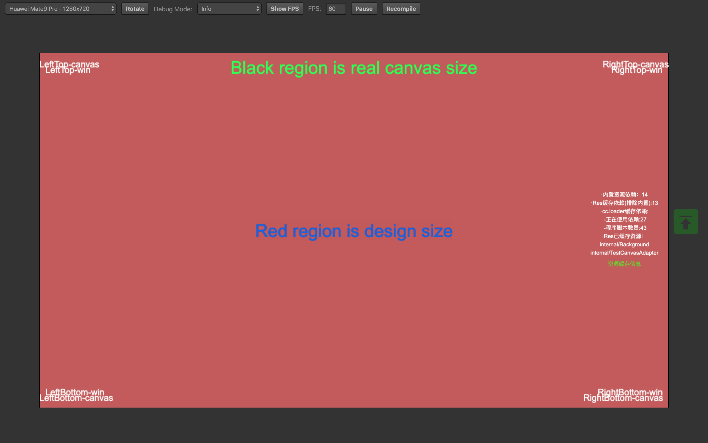
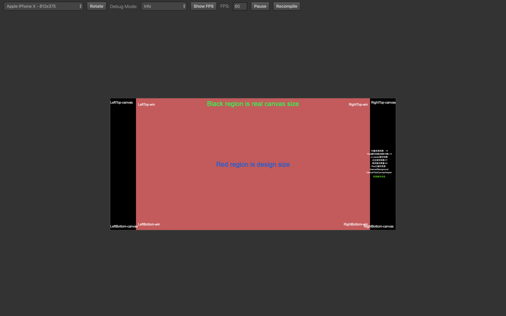
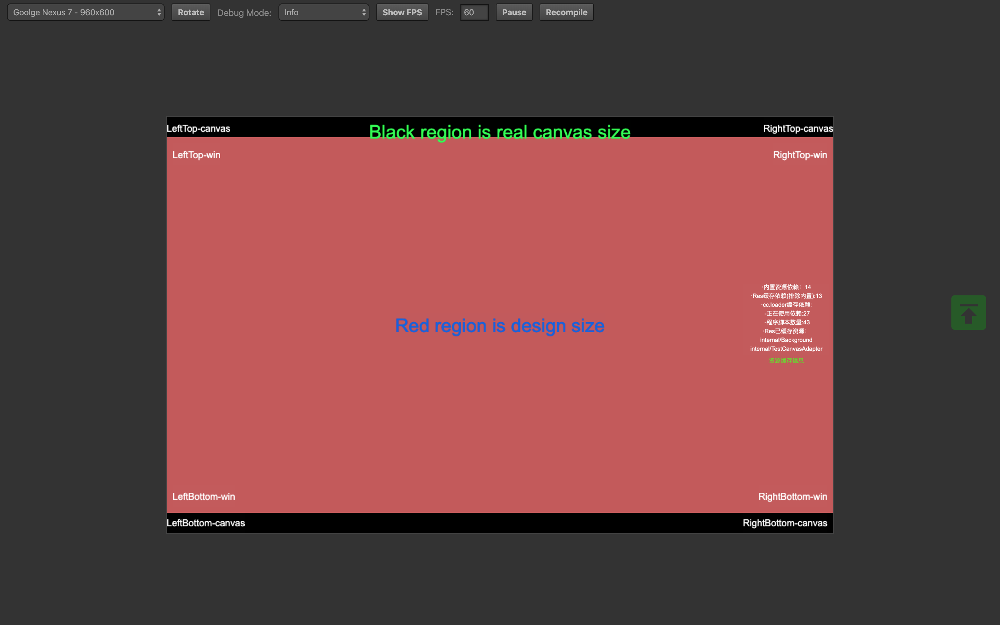

# CanvasAdapter

**CanvasAdapter**是一个超轻量级的 `Cocos Creator` 屏幕自动适配的方案，通过监听窗口的尺寸变化分发事件，由挂载该组件的节点完成尺寸或者位置的自动适配。

## 近期调整说明

**2020.02.17**

按照目前的使用情况，该脚本可以调整得更简洁一些，目前新的版本正在开发中，很快更新。

**2020.02.22**
完成新版适配方案，完全根据 Widget 配置完成适配。

## 使用须知

- 使用此组件需要将 `Canvas` 的适配模式改为`SHOW_ALL`，也就是说要把 `Canvas`组件的 `Fit Width` 和 `Fit Height` 都勾选上。

## 测试样例

- 红色背景区域是设计尺寸，黑色背景区域是实际窗口尺寸；

- `LeftTop-canvas`、`LeftBottom-canvas`、`RightBottom-canvas`、`RightTop-canvas` 根据窗口尺寸适配；

- `LeftTop-win`、`LeftBottom-win`、`RightBottom-win`、`RightTop-win` 根据设计尺寸适配；

> 以下分别是在**HuaWei Mate9**、**iPhoneX** 和 **Nexus7**下模拟的结果：

